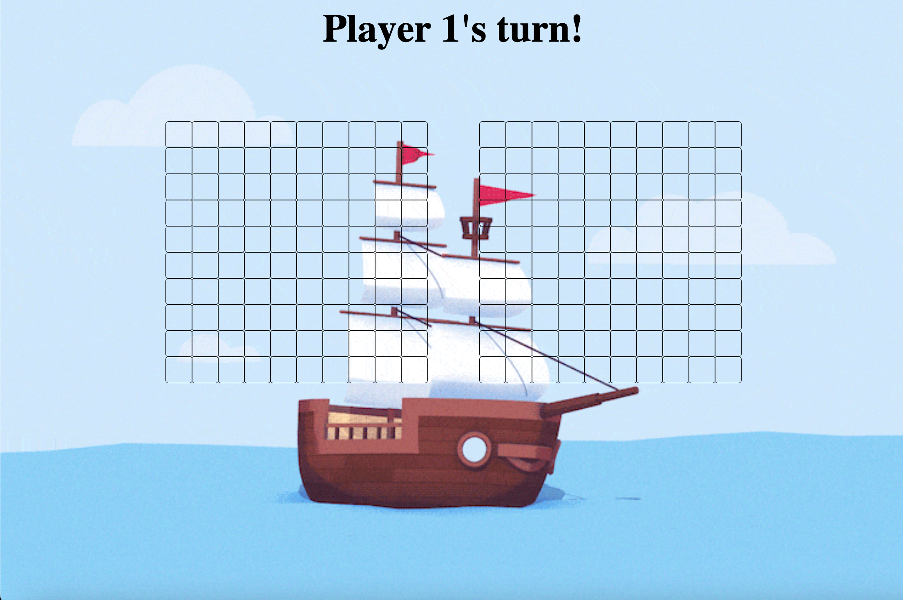
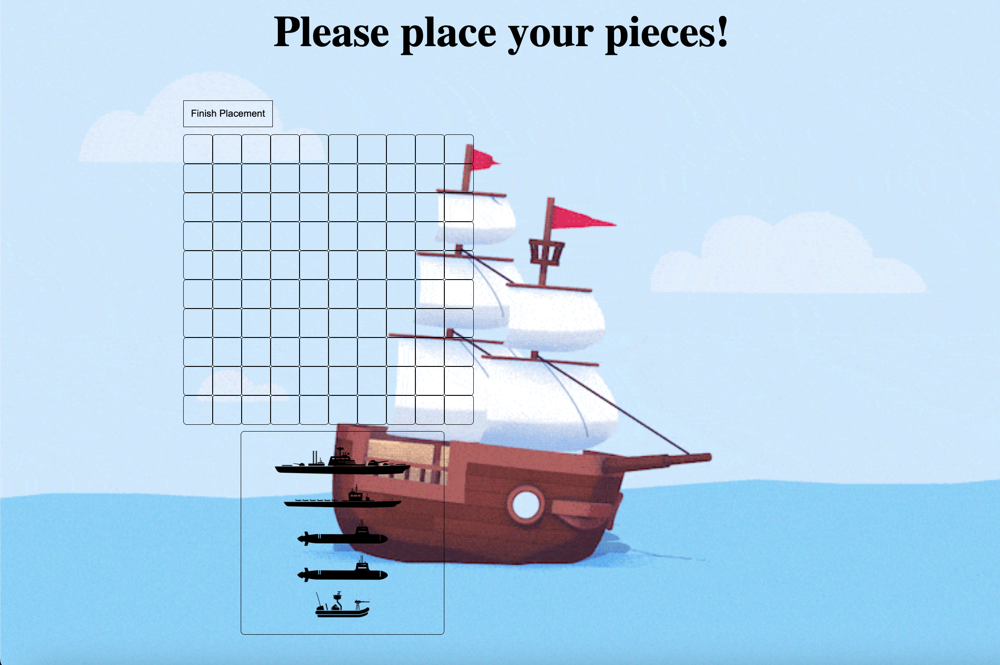

# Battleship

## How to play
1. Select Game Mode(Currently Limited to two player mode)
2. To place pieces, drag the desired piece to the desired tile. The tile you hover over with the crusor will be the placement tile for the whole ship. To change the orientation of the pieces, double click the ships.
3. When all pieces are placed, press the proceed button located above the game board.
4. Pass the computer to the second player to ensure confidentiality.
5. Repeat the process above.
6. When all pieces are set, press the proceed button above the game board.
7. Take turns aiming at pieces.

## Technologies Used
* Javascript
* CSS
* HTML5

## Where to Play

Click [here](https://main--transcendent-dusk-9e85a7.netlify.app](https://main--transcendent-dusk-9e85a7.netlify.app)https://main--transcendent-dusk-9e85a7.netlify.app) to play.

## Screenshots

## Bugs
* I honestly dont know. I think I removed quite a few and polished it pretty well... Please let me know if you find some.

## Ice box
* Implementing random ship placements
* Implementing an single player mode with AI integration.
* Showing the ship imaged within the tiles hit